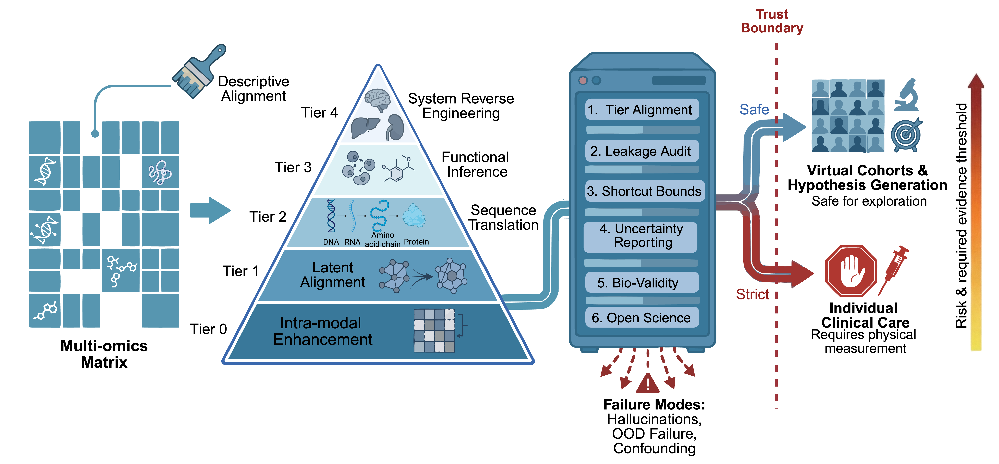

# MIGOE: Minimum Information for Generative Omics Evaluation

[](https://creativecommons.org/licenses/by/4.0/)
[](CONTRIBUTING.md)

## Overview

The MIGOE (Minimum Information for Generative Omics Evaluation) framework establishes rigorous standards for evaluating generative AI models in omics research. It addresses critical challenges in establishing trust boundaries and audit standards for clinical artificial intelligence (ACI) deployment.



## Core Values

- **Trust Boundary Definition**: Clearly define the capability scope and limitations of generative omics models
- **Audit Standards**: Provide repeatable and verifiable evaluation methodologies
- **Clinical Translation Support**: Ensure quality assurance for ACI system deployment
- **Community-Driven Updates**: Continuously integrate latest research and best practices

## Target Audience

- Multi-omics data scientists and bioinformaticians
- Generative AI model developers
- Clinical metabolomics researchers
- Medical AI regulators and auditors
- Precision medicine and translational medicine practitioners

---

## Six Core Principles

The framework strictly requires adherence to the following six core principles:

### 1. Tier Alignment & Generation Card

**Principle**: Model evaluation must be strictly aligned with its claimed maturity tier to prevent using evidence from lower tiers to support higher-tier generalization claims.

**Key Requirements:**
- **Generation Card Disclosure**: Document all sampling iterations, random seed strategies, and post-processing filtering rules
- **Tier Declaration**: Specify target tier with rationale
- **Zero-shot Criteria**: Clarify data usage during pre-training, fine-tuning, or adaptation

**Implementation Checklist:**
- [ ] Document all random seeds used (not just the "best" one)
- [ ] Report the number of generation attempts
- [ ] Disclose any post-hoc filtering or selection criteria
- [ ] Align evaluation metrics with the claimed maturity tier
- [ ] Provide statistical distribution of results across multiple runs

---

### 2. Data Provenance & Leakage Audit

**Principle**: Authors must explicitly report the physical isolation among pre-training corpora, fine-tuning datasets, and independent test sets.

**Key Requirements:**
- **Strict Data Partitioning**: Partition at the patient/donor level (not cell level)
- **Cohort Disclosure**: Detail origins, platforms, temporal coverage, and missingness mechanisms
- **Overlap Audit**: Provide evidence of strict Train/Validation/Test isolation

**Implementation Checklist:**
- [ ] Document complete data provenance (source, collection date, processing pipeline)
- [ ] Verify patient/donor-level splitting for omics data
- [ ] Audit for sample overlaps between train/validation/test sets
- [ ] Check for shared biological covariates (e.g., batch effects, sequencing platform)
- [ ] Identify and report any technical confounders
- [ ] Provide data partition statistics (number of unique patients/donors per split)

---

### 3. Baseline & Shortcut Audit

**Principle**: Generative models must be benchmarked against robust non-generative baselines to conclusively demonstrate genuine learning of complex biological manifolds.

**Key Requirements:**
- **Mandatory Baseline Comparisons**: Compare against KNN, mean imputation, PCA, linear regression
- **Shortcut Ablation**: Test confounder dependence by permuting technical covariates
- **Distribution Matching**: Report global mixing metrics (Wasserstein distance, MMD, LISI)

**Implementation Checklist:**
- [ ] Implement at least 3 non-generative baseline methods
- [ ] Report baseline performance using identical evaluation metrics
- [ ] Conduct statistical significance tests (e.g., paired t-test, Wilcoxon)
- [ ] Analyze where the generative model outperforms/underperforms baselines
- [ ] Justify computational cost vs. performance gain
- [ ] Test for shortcut learning (e.g., does the model rely on batch effects?)

---

### 4. Uncertainty Quantification & Boundary Reporting

**Principle**: The model must output confidence intervals or calibration metrics for generated features, explicitly delineating out-of-distribution (OOD) or low-confidence generation boundaries.

**Key Requirements:**
- **Uncertainty Metrics**: Confidence intervals, ECE, epistemic and aleatoric uncertainty
- **Stratified Metrics**: Report performance by center, subpopulations, and feature frequency
- **OOD Extrapolation**: Evaluate calibration drift on external cohorts

**Implementation Checklist:**
- [ ] Provide confidence intervals or credible intervals for generated features
- [ ] Report Expected Calibration Error (ECE)
- [ ] Implement OOD detection mechanism
- [ ] Distinguish epistemic vs. aleatoric uncertainty
- [ ] Visualize uncertainty distributions
- [ ] Define explicit boundaries where predictions should not be trusted
- [ ] Validate calibration on held-out data

---

### 5. Downstream Biological Validity

**Principle**: Evaluation metrics must never be limited to mathematical reconstruction errors. They must encompass biological consistency and validity in downstream tasks.

**Key Requirements:**
- **Beyond Reconstruction**: Evaluate differential expression, cell clustering, survival prediction
- **DE Consistency**: Compare generated vs. real DE gene lists
- **Topological Consistency**: Assess structure using ARI, NMI, manifold visualization
- **Clinical Empirical Loop**: Validate on held-out paired measurements

**Implementation Checklist:**
- [ ] Report standard reconstruction metrics (MSE, Pearson r, etc.)
- [ ] Evaluate on at least 2 downstream biological tasks
- [ ] Test preservation of rare biological signals
- [ ] Validate known biological relationships (e.g., gene-gene correlations)
- [ ] Compare downstream task performance: real vs. generated data
- [ ] Assess biological plausibility with domain experts
- [ ] Check for preservation of data structure (e.g., manifold topology)

---

### 6. Open Science & Living Guidelines

**Principle**: Authors must provide complete source code, environmental containers, and minimally reproducible demos to ensure independent verification.

**Key Requirements:**
- **Code & Environment**: Release complete scripts with Docker/Conda specifications
- **Minimal Reproducible Design**: Provide cloud-executable demo (< 10 min runtime)
- **Weight Disclosure**: Provide pre-trained model weights
- **Ethics & Privacy**: State IRB approvals and re-identification risk assessments

**Implementation Checklist:**
- [ ] Publish code on public repository (GitHub, GitLab, etc.)
- [ ] Provide Docker/Singularity container or detailed environment specification
- [ ] Release model weights (or provide access mechanism)
- [ ] Document all hyperparameters in configuration files
- [ ] Include random seeds in code and documentation
- [ ] Create minimal working example (< 100MB data, < 10 min runtime)
- [ ] Provide step-by-step reproduction instructions
- [ ] Specify software versions and dependencies
- [ ] Include unit tests or validation scripts

---

## Summary Table

| Core Dimension | Evaluation Objective | Minimum Reporting & Metrics | Common Failure Modes |
|----------------|---------------------|----------------------------|---------------------|
| **1. Tier Alignment & Generation Card** | Align capabilities with claims; ensure auditable generation. | • **Tier declaration**: Specify target Tier (0–4) with a concise rationale based on task complexity and data modalities.<br>• **Zero-shot criteria**: Specify if target-cohort or target-modality paired data were used during pre-training, fine-tuning, or adaptation.<br>• **Generation card**: Disclose output type (point estimates vs. sampled distributions), sampling frequency, random seed strategy, and post-processing/QC rules. | • **Tier mismatch**: Using lower-tier evidence for higher-tier claims<br>• **Cherry-picking**: Selectively reporting favorable random seeds or filtered samples to inflate performance. | 
| **2. Data Provenance & Leakage Audit** | Define in-domain boundaries; prevent test set contamination. | • **Cohort disclosure**: Detail cohort origins, sequencing platforms, temporal coverage, and missingness mechanisms; provide a per-modality "missingness map".<br>• **Strict isolation**: Mandate data splitting at the patient/donor level (not cell level); assign all longitudinal time points from one individual to a single split.<br>• **Overlap audit**: Provide evidence of strict Train/Validation/Test physical isolation (e.g., Jaccard similarity of IDs, hash checks). | • **Implicit bias**: Over-reliance on single center/platform<br>• **Data leakage**: (Improper splitting allows test distribution visibility via cell-level random splitting (donor overlap) or inclusion of future time-point samples. |
| **3. Baseline & Shortcut Audit** | Prevent learning technical noise; justify generative architecture complexity. | • **Shortcut ablation**: Re-evaluate performance after splitting by center or permuting technical covariates (e.g., batch, platform labels) to test confounder dependence.<br>• **Baseline comparison**: Compare end-to-end against non-generative baselines (e.g., KNN, mean imputation, PCA); report performance delta (Δ).<br>• **Distribution matching**: Report global mixing metrics (e.g., Wasserstein distance, MMD, LISI) as a sanity check. | • **Shortcut learning**: The model predominantly memorizes batch effects or clinical covariates instead of underlying biological mechanisms.<br>• **Posterior collapse**: Ignoring latent variables, degenerating into a simplistic mean output.<br>• **Occam's razor failure**: Added complexity is unjustified as simple baselines perform comparably. |
| **4. Uncertainty Quantification & Boundary Reporting** | Establish trust boundaries; prevent mean performance from masking long-tail failures.| • **Stratified metrics**: Report performance stratified by center, key clinical/cell subpopulations, and feature frequency (e.g., common vs. rare cell types/genes).<br>• **Calibration**: Report Expected Calibration Error (ECE), predictive variance, or latent-space entropy across subgroups.<br>• **OOD extrapolation**: Evaluate performance and calibration drift (e.g., AUROC/ECE shift) on ≥ 1 external cohort. | • **Overconfidence**: Assigning high confidence to completely unseen or anomalous samples.<br>• **Long-tail collapse**: Strong average metrics masking severe degradation on rare, clinically critical subpopulations. |
| **5. Downstream Biological Validity** | Move from "looking similar" to "being biologically useful"; verify biological logical consistency and downstream task relevance. | • **DE consistency**: Compare generated vs. real differentially expressed (DE) gene lists using rank correlation or Jaccard index, with special attention to non‑trivial DEGs and clinically relevant pathways.<br>• **Topological consistency**: Assess global structure and local neighborhoods using ARI, NMI, or manifold visualization (e.g., UMAP/Seurat).<br>• **Clinical loop**: Validate ≥ 1 downstream task on held-out paired empirical measurements (e.g., survival C-index). | • **Signal dilution**: Over-smoothing to minimize global MSE, erasing distinctive signals of rare subpopulations.<br>• **Ghost samples**: Generating biologically incoherent profiles where mutually exclusive genes are highly co-expressed. |
| **6. Open Science & Living Guidelines** | Ensure independent verification; build trust in AI-driven biology. | • **Code & environment**: Release complete preprocessing, training, and inference scripts with Docker/Conda specifications.<br>• **Minimal reproducible design**: Provide a cloud-executable demo (e.g., Colab) and a lightweight toy dataset (≤ 10 min execution).<br>• **Weight disclosure**: Provide pre-trained model weights.<br>• **Ethics**: State IRB approvals, data-use agreements, and re-identification risk assessments for generated data. | • **Environment dependency**: "Works on my machine"; fails elsewhere due to version conflicts.<br>• **Hyperparameter black box**: Undisclosed key coefficients or noise schedules preventing robust reproduction.<br>• **Privacy risk**: Unaddressed re-identification risks for generated patient data. |

---

## Compliance Levels

### Minimum Compliance (Required)
- Address all 6 principles
- Complete all "must" requirements
- Provide basic documentation

### Recommended Compliance
- Complete all implementation checklists
- Provide detailed supplementary materials
- Engage with community feedback

### Exemplary Compliance
- Exceed minimum requirements
- Contribute case studies to the community
- Participate in framework evolution

---

## Quick Start

### For Researchers
1. Review the six core principles above
2. Use the implementation checklists to evaluate your model
3. Prepare Generation Card and documentation
4. Ensure compliance before publication

### For Reviewers
1. Use MIGOE principles as a systematic review checklist
2. Verify Generation Card completeness (Principle 1)
3. Audit data partitioning (Principle 2)
4. Check baseline comparisons (Principle 3)
5. Assess uncertainty quantification (Principle 4)
6. Evaluate biological validity (Principle 5)
7. Confirm reproducibility (Principle 6)

### For Contributors
We welcome community contributions! See [CONTRIBUTING.md](CONTRIBUTING.md) for:
- How to suggest improvements
- Literature additions
- Case study submissions
- Issue reporting

---

## Citation

If you use the MIGOE framework in your research, please cite:

```bibtex
@misc{migoe2026,
  title={MIGOE: Minimum Information for Generative Omics Evaluation},
  author={[Author Team]},
  year={2026},
  howpublished={\url{https://github.com/[username]/MIGOE}},
  note={A framework for establishing trust boundaries in generative omics}
}
```

---

## License

This project is licensed under the [Creative Commons Attribution 4.0 International License (CC BY 4.0)](LICENSE).

You are free to:
- **Share** — copy and redistribute the material in any medium or format
- **Adapt** — remix, transform, and build upon the material for any purpose

Under the following terms:
- **Attribution** — You must give appropriate credit, provide a link to the license, and indicate if changes were made

---

## Contact

- **Issues**: [GitHub Issues](../../issues)
- **Discussions**: [GitHub Discussions](../../discussions)
- **Email**: [project-email@example.com]

---

## Acknowledgments

We thank all researchers, reviewers, and community members who contribute to the MIGOE framework.

---

**Version**: 1.0  
**Last Updated**: March 2026  
**Status**: Living Document - Open for Community Feedback
